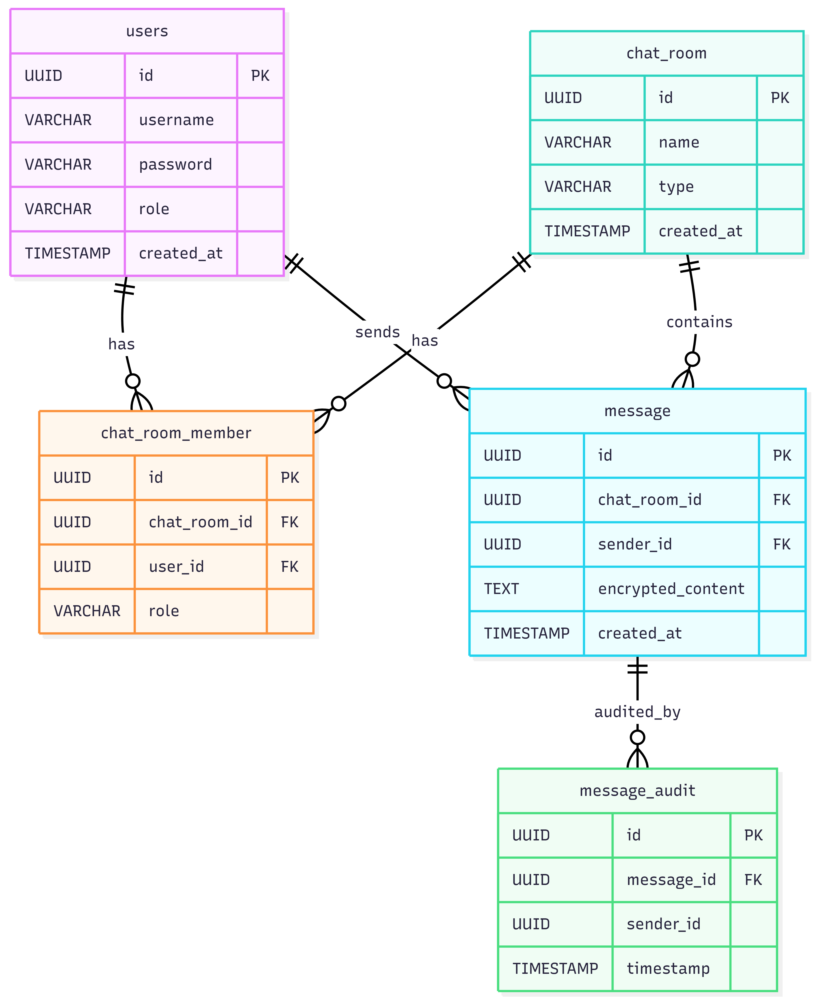
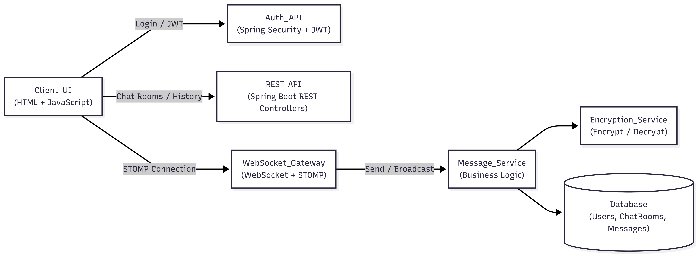

# Chat Application — Spring Boot & WebSockets
## Project Overview

The **Chat Application** is a real-time messaging platform built using **Spring Boot and WebSockets**, supporting private and group-based communication.
It combines REST APIs for management operations with **STOMP** over WebSockets for live message delivery, ensuring scalability, security, and persistent chat history.

The system enforces authentication, authorization, encrypted message storage, and role-based group access.

## Objectives

- Enable real-time one-to-one and group chat
- Ensure secure authentication using JWT
- Persist chat history with encrypted message storage
- Enforce role-based group management
- Separate real-time communication from REST-based operations

## Tech Stack
| Layer              | Technology |
|--------------------|-------------|
| Backend            | Spring Boot, Spring Data JPA |
| Realtime Messaging | Java WebSocket, STOMP |
| Database           | MySQL |
| Build Tool         | Maven |
| Language           | Java 17 |
| Frontend           | HTML, JavaScript|

## Core Features

### Authentication & Authorization

- User login generates a JWT token
- JWT is validated for all secured REST APIs
- Token contains user identity and role information
- Stateless authentication ensures scalability
- WebSocket connections validate user identity before subscription

### User Management

- User registration and login APIs
- Passwords stored using BCrypt hashing
- Users are uniquely identified across chat rooms
- JWT token is required for accessing protected endpoints

### Chat Room Management

#### Supports:
- One-to-One chat rooms
- Group chat rooms
- Each chat room has a unique identifier

#### Group chat behavior:
- Creator is automatically assigned ADMIN role
- Only admins can manage group members

#### Group Membership & Roles
- Users are linked to chat rooms via membership mapping
- Role-based permissions:
    - `ADMIN`: Add or remove members
    - `MEMBER`: Send and receive messages
- Membership validation enforced before message access

#### Real-Time Messaging
- Uses `STOMP` over `WebSockets`
- Messages are delivered instantly to subscribed users
- Each chat room acts as a dedicated messaging channel
- No polling or page refresh required

#### Message Persistence & Encryption
- All messages are stored in the database
- Message content is:
    - Encrypted before persistence
    - Decrypted only during retrieval
    - Ensures sensitive data is never stored in plain text
    - Encryption logic is handled at the service layer

#### Chat History
- REST APIs provide chat history per chat room 
- Messages are decrypted before being returned
- Only authorized chat room members can access history
- Ensures consistency between real-time and stored messages

## 🗄️ Database Tables
| Table Name | Description |
|-------------|-------------|
| users | Stores user credentials and identity |
| chat_room | Stores chat room metadata |
| chat_room_member | Maps users to chat rooms with roles |
| message | Stores encrypted chat messages |
| message_audit Stores | sender and timestamp metadata|

## ER Diagram (Structure)


## High-Level Architecture (HLD)


## How to Run
1. **Clone the repository**
2. **Configure database settings**
3. **Run the Spring Boot application**
4. **Access the chat UI via browser**
    ```bash
   http://localhost:8080/chat.html?chatRoomId={Your_Chat_Room_ID}
5. **Authenticate and start messaging**
